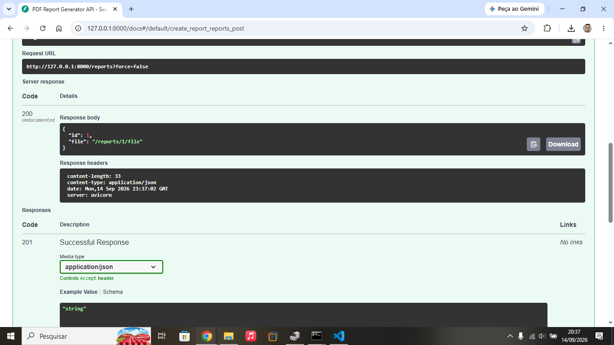

# PDF Report Generator API

Automated report generation pipeline that queries SQLite aggregated data, renders HTML templates into styled PDF documents, and serves artifacts via persistent API links using Python, FastAPI, and Playwright.

---

**Setup & Execution Instructions**

To get the project running locally, execute the following commands in sequence within your terminal:

* **Activate Virtual Environment:** `.venv\Scripts\activate.bat`
* **Install Project Dependencies:** `pip install fastapi uvicorn playwright`
* **Install Chromium Headless Browser:** `playwright install chromium`
* **Seed the SQLite Database:** `python seed.py`
* **Launch API Server:** `uvicorn main:app --reload`

---

**SQL Aggregation Queries**

The data aggregation pipeline relies on three main SQL queries executed directly against the SQLite database:

> **1. Total Orders & Total Revenue**  
> `SELECT COUNT(*) as total_orders, COALESCE(SUM(amount), 0) as total_revenue FROM orders;`

> **2. Top 5 Products by Revenue**  
> `SELECT product, SUM(amount) as revenue, COUNT(*) as qty FROM orders GROUP BY product ORDER BY revenue DESC LIMIT 5;`

> **3. Daily Sales Performance (Last 7 Days)**  
> `SELECT DATE(created_at) as order_date, COUNT(*) as daily_orders, SUM(amount) as daily_revenue FROM orders WHERE created_at >= DATE('now', '-7 days') GROUP BY DATE(created_at) ORDER BY order_date DESC;`

---

**API Execution Proofs**

**Initial POST /reports Request (HTTP 201 Created)**

**Duplicate POST /reports Request (HTTP 200 OK - Idempotency Validation)**

---

**Technical Questions & Reflection**

* **At what point would you move this work out of the request?**  
Moving generation out of the request into an asynchronous background job worker is necessary when query execution, dataset size, or browser PDF rendering causes the HTTP request execution time to exceed acceptable SLA limits (typically > 2–3 seconds), risking client connection timeouts under heavy concurrency.

* **What does your idempotency check protect against, and what is a real-world example?**  
The idempotency check prevents duplicate artifact creation, unnecessary disk usage, and redundant CPU/GPU compute cycles when users double-click submit buttons. In real-world systems, missing idempotency checks can lead to double billing customers or firing duplicated transaction emails.